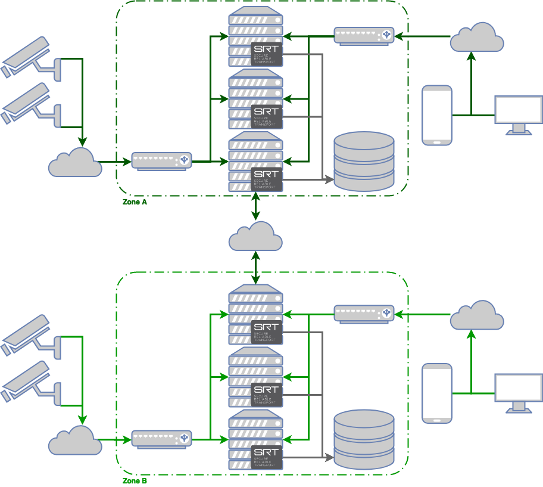
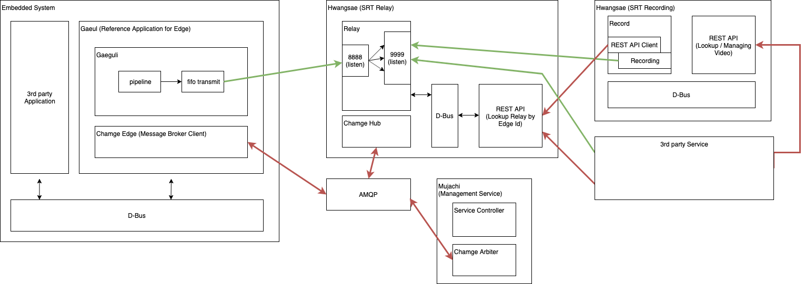

# Ultra-Low latency video transport 

We are planning to build new streaming system for a cloud-based video surveillance service.
In the new system, Secure Reliable Transport (SRT) will be used as a base protocol to archive
the critical requirements; ultra-low latency, packet loss recovery. 
SRT is considered to meet these requirements, but it is not enough to integrate to the existing service,
or newly developing business model. Hence, this project aims to develop SRT based ecosystem to satisfy 
various requirements; high performance, high scalability, and 3rd-party friendly SDK.
The final goal is to implement whole software stacks from embedded system to user application.



## Overview
The ecosystem consists of a distributed system that allows clients to access Edge devices streaming using SRT protocol to provide ultra low latency video.



## Modules
*   [Chamge](https://github.com/hwangsaeul/chamge/blob/master/README.md): Control channel for the SRT environmet

*   [Gaeguli](https://github.com/hwangsaeul/gaeguli/blob/master/README.md): SRT streaming library generator

*   [Gaeul](https://github.com/hwangsaeul/gaeul/blob/master/README.md): A reference application that uses *Chamge* and *Gaeguli* to generate SRT stream on edge device

*   [Hoppfish](https://github.com/hwangsaeul/hoppfish/blob/master/README.md): REST API implementation

*   [Hwangsae](https://github.com/hwangsaeul/hwangsae/blob/master/README.md): Relay and Recorder servers

## Libraries APIs
*   [Chamge](doc/chamge/index.html): Control channel for the SRT environmet

*   [Gaeguli](doc/gaeguli/index.html): SRT streaming library generator

*   [Hwangsae](doc/hwangsae/index.html): Relay and Recorder servers

## Description
To allow N different clients to access the streaming genearted by an Edge device, this project implements a distributed system.

Edge devices running *Gaeul Agent* or Servers running *Hwangsaeul Relay Agent* register into the network using *chamge* library and AMQP protocol which establish a communication channel between them. Third party applications which desire to receive streaming from a specific Edge device can request it to *Hwangsaeul Relay Agent* using its REST API.

Once Relay receives a request to start streaming, it sends a specific command to the Edge device through the control channel, once this is received, the Edge will start to send SRT streaming using *Gaeguli* library to the Relay.

Third party applications will receive a SRT URI from the Relay which will be used to retrieve the desired streaming.

*Hwangsaeul Recorder Agent* can be seen as a particular case of third party application, which contacts the Relay to access the streaming and records it in a local filesystem.
## Visualized Effort

<iframe width="480" height="270" src="https://www.youtube.com/embed/ibRuFMJGffQ?controls=0" frameborder="0" allow="accelerometer; autoplay; encrypted-media; gyroscope; picture-in-picture" allowfullscreen></iframe>

This video is compact visualization of our efforts from the beginning. We will try to keep updating every month.

```
$ gource \
        -1920x1080 \
        -s .2 --auto-skip-seconds .2 \
        --multi-sampling \
        --stop-at-end \
        --output-framerate 30 \
        --hide mouse,progress \
        --highlight-users \
        --output-ppm-stream - \
        combined.log  | \
        avconv -y -r 30 -f image2pipe -vcodec ppm -i - \
        -b 32768k hwangsaeul.mp4 
```
